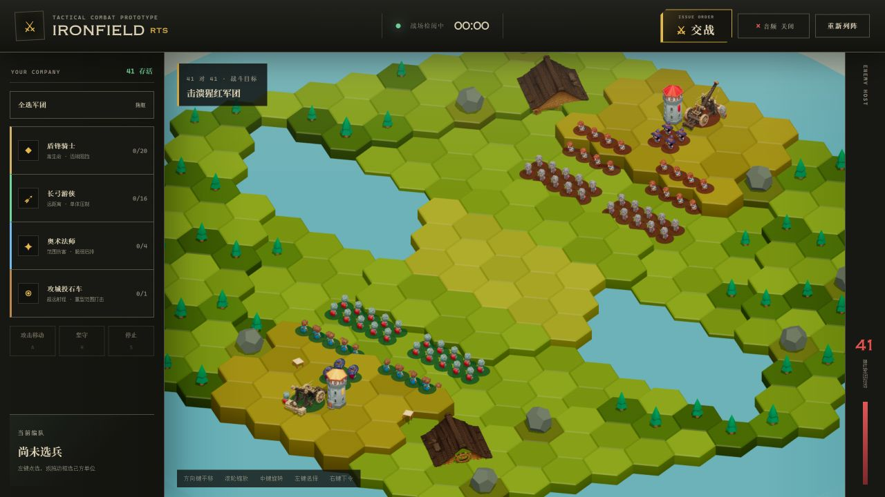

# 阶段 0 回归基线

记录时间：2026-08-15

分支：`dev`

基线提交：`e4cc325 Initialize Ironfield RTS prototype`

## 自动检查

功能开发前运行 `pnpm check`，结果如下：

- ESLint：通过。
- TypeScript：通过。
- 音效目录校验：通过。
- Tripo 运行时模型校验：通过。
- Vitest：14 个测试文件、68 个测试全部通过。
- 生产构建：通过。
- 已存在的构建提示：主入口压缩前为 1,170.90 kB，Vite 提示单个 chunk 超过 500 kB。该提示属于基线问题，不是阶段 0、1、2 引入的回归。

## 画面基线

1280×720 初始战场截图：

## 阶段 5 需要替换的旧行为测试

以下用例依赖手动命令、主动后撤或败退规则。进入自动冲锋阶段时，要用新的自动部署与目标选择测试替换，不能简单删除覆盖：

- `tests/game/battle.test.ts`：编队移动、部署等待窗口、攻击移动、指定攻击和远程兵保持距离相关用例。
- `tests/game/formation.test.ts`：重复移动命令、停止、攻击移动和坚守相关用例。
- `tests/game/combat-behavior.test.ts`：受压远程兵向后移动、显式集火、败退触发和败退返回营地相关用例。
- `tests/game/battle-session.test.ts`：交战前命令锁定规则。部署式玩法接入后需要改为部署权限规则。

以下基础覆盖继续保留：投射物飞行与命中、伤害事件、范围伤害、单位死亡只触发一次、事件窗口、固定输入的确定性、六边形寻路和地图连通性。
